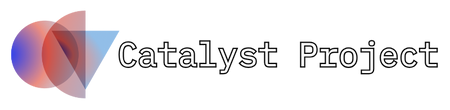

<div align="center">
  <h1>oss.now</h1>
  <h3>A platform for open source project discovery, collaboration, and growth</h3>
  <p>Connecting project owners with contributors</p>

[](https://l.oss.now/discord)
[](https://l.oss.now)
[](#license)
[](https://turbo.build)

</div>

---

<br/>
<div align="center" style="display:flex; align-items:center; justify-content:center;gap:14px;">
<a href="https://vercel.com/oss">
  
</a>



</div>
<br/>
<br/>

---

## About

oss.now is a modern platform designed to bridge the gap between open source project maintainers and contributors. Whether you're looking to showcase your project, find contributors with specific skills, or discover exciting projects to contribute to, oss.now provides the tools and community to make it happen.

### Key Features

- **Project Discovery** - Browse and filter open source projects by category, technology, and activity
- **GitHub & GitLab Integration** - Seamlessly connect your repositories and showcase real-time stats
- **Project Launches** - Announce major releases and updates to the community
- **Early Submissions** - Submit your project early for increased visibility
- **Contributor Matching** - Find contributors with the skills your project needs

## 🛠️ Tech Stack

- **Frontend**: Next.js 15 (App Router) + React 19 + TypeScript + Turbopack
- **Styling**: Tailwind CSS + shadcn/ui components
- **Linting & Formatting**: Prettier + ESLint
- **Backend**: tRPC + Node.js
- **Database**: PostgreSQL (via Neon) + DrizzleORM
- **Caching**: Redis (Upstash)
- **Authentication**: Better-Auth with GitHub & GitLab OAuth
- **Analytics**: [Databuddy](https://databuddy.cc/) - [repo](https://github.com/databuddy-analytics/databuddy)
- **Deployment**: Vercel
- **Monorepo**: Turborepo

## Project Structure

This is a monorepo managed with Turbo:

```
ossdotnow/
├── apps/
│   └── web/          # Next.js web application
├── packages/
│   ├── api/          # tRPC API routes
│   ├── auth/         # Authentication logic
│   ├── db/           # Database schema and migrations
│   ├── env/          # Environment variable validation
│   └── ui/           # Shared UI components
└── turbo.json        # Turbo configuration
```

## Getting Started

### Prerequisites

- [Bun](https://bun.sh/) v1.2.19 or higher
- [Docker](https://www.docker.com/) (for local PostgreSQL and Redis)
- Git

### Installation

1. **Clone the repository**

   ```bash
   git clone https://github.com/ossdotnow/ossdotnow.git
   cd ossdotnow
   ```

2. **Install dependencies**

   ```bash
   bun install
   ```

3. **Set up environment variables**

   Make a copy of `.env.example` and replace values with your own.

4. **Start the database services**

   ```bash
   bun docker:up
   ```

5. **Run database migrations**

   ```bash
   bun db:migrate
   ```

6. **Seed the database (optional)**

   ```bash
   bun db:seed
   ```

7. **Start the development server**

   ```bash
   bun dev
   ```

   The application will be available at `http://localhost:3000`

## Available Scripts

### Development

- `bun dev` - Start the development server with hot reload
- `bun build` - Build the application for production
- `bun start` - Start the production server

### Database

- `bun docker:up` - Start PostgreSQL and Redis containers
- `bun docker:down` - Stop the containers
- `bun docker:clean` - Stop containers and remove volumes
- `bun db:generate` - Generate database migrations
- `bun db:migrate` - Apply database migrations
- `bun db:push` - Push schema changes directly (development only)
- `bun db:studio` - Open Drizzle Studio for database management
- `bun db:seed` - Seed the database with sample data
- `bun db:seed-launches` - Seed the database with sample project launches
- `bun db:make-all-admin` - Grant admin privileges to all users (development only)

### Code Quality

- `bun lint` - Run ESLint
- `bun format` - Format code with Prettier
- `bun typecheck` - Run TypeScript type checking

## Setting up OAuth Providers

### GitHub OAuth

1. Go to [GitHub Developer Settings](https://github.com/settings/developers)
2. Click "New OAuth App"
3. Fill in the details:
   - Application name: `oss.now (Development)`
   - Homepage URL: `http://localhost:3000`
   - Authorization callback URL: `http://localhost:3000/api/auth/callback/github`
4. Copy the Client ID and Client Secret to your `.env` file

### GitLab OAuth

1. Go to [GitLab Applications](https://gitlab.com/-/user_settings/applications)
2. Create a new application with the following:
   - Name: `oss.now (Development)`
   - Redirect URI: `http://localhost:3000/api/auth/callback/gitlab`
   - Scopes: `api`, `read_api`, `read_user`, `read_repository`, `openid`, `profile`, `email`
3. Copy the Application ID (Client ID) and Secret to your `.env` file

## 🤝 Contributing

We love contributions! Please read our [Contributing Guide](CONTRIBUTING.md) to learn about our development process, how to propose bug fixes and improvements, and how to build and test your changes.

### Development Workflow

1. Fork the repository
2. Create a new branch from `dev` (not `main`)
   ```bash
   git checkout -b feature/your-feature-name
   ```
3. Make your changes
4. Run tests and ensure code quality
   ```bash
   bun lint
   bun typecheck
   ```
5. Commit your changes with descriptive messages
6. Push to your fork and create a Pull Request

### Important Notes

- Always branch off from `dev`, not `main`
- Make sure no other Next.js apps are running locally as it may interfere with OAuth flows
- The application is currently in development mode on production to prevent public access

## Deployment

The application is designed to be deployed on Vercel:

1. Fork this repository
2. Import the project in Vercel
3. Configure environment variables in Vercel dashboard
4. Deploy!

For production deployments, ensure you:

- Update OAuth callback URLs to your production domain
- Use production database and Redis instances
- Set `VERCEL_ENV=production`

## Architecture

### Frontend

- **Next.js 15** with App Router for server-side rendering and routing
- **React 19** for UI components
- **TanStack Query** for data fetching and caching
- **Tailwind CSS** for styling
- **shadcn/ui** for consistent UI components

### Backend

- **tRPC** for type-safe API endpoints
- **DrizzleORM** for database queries and migrations
- **Better-Auth** for authentication
- **Upstash Redis** for rate limiting

### Database Schema

- Users and authentication tables
- Projects with categories and metadata
- Submissions and waitlist
- Project launches and comments
- Voting and reporting systems

## Troubleshooting

### Common Issues

1. **OAuth redirect issues**
   - Ensure no other Next.js apps are running on port 3000
   - Check that callback URLs match exactly

2. **Database connection errors**
   - Make sure Docker is running
   - Check that PostgreSQL is accessible on port 5432
   - Verify DATABASE_URL is correct

3. **Environment variable errors**
   - All required variables must be set
   - Run `bun dev` to see validation errors

## License

This project is licensed under the MIT License - see the [LICENSE](LICENSE) file for details.

## Acknowledgments

- Built with [Next.js](https://nextjs.org/)
- UI components from [shadcn/ui](https://ui.shadcn.com/)
- Database provided and powered by [Neon](https://neon.tech/)
- Hosting on [Vercel](https://vercel.com/)
- ***

<div align="center">
  Made with ❤️ by the oss.now team
</div>
